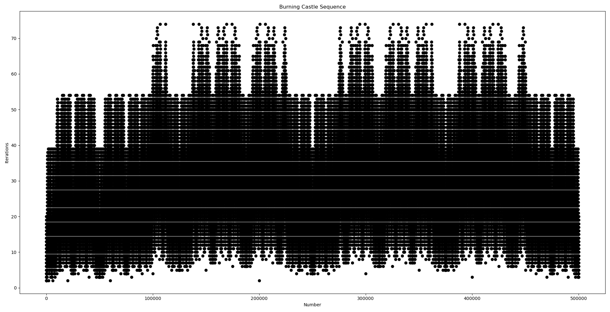

# The Initial Algorithm
For a given decimal number `x` such that `0 <= x < 1`, we double the number and subtract 1, then take it's absolute value. Whenever the input has prepended zero(s) in its decimal part we remove the prepending zero(s) and shift the digits to the left, which is equivalent to multiplying the number with 10 when it is less than 0.1. We do this **before** the `|2x-1|` operation.

Suppose that we do this operation recursively, and we keep track of the numbers that go into the `|2x-1|` operation, **ignoring the ones that have prepended zeros in it**. We only stop when we come across to a number that we have seen before. **What we return in the end is the total number of numbers seen throughout this process**. That is the _Burning Castle_ number! 

This is described by the following algorithm:
```python
input: x
while x is not seen before
  # get rid of prepending zeros
  while x < 0.1
    x = x * 10 
  end while
  see(x)  
  x = |2*x - 1|
end while
output: number of seen values
```

A few examples are:
- `0.2 -> 0.6 -> 0.2` (2 unique values)
- `0.5 -> 0.0 -> 1.0 -> 1.0` (3 unique values)
- `0.12 -> 0.76 -> 0.52 -> 0.4 -> 0.2 -> 0.6 -> 0.2` (6 uniqe values). Notice how we did not *see* `0.04` which came right after `0.52` but it was less than `0.1`.

# Moving from Reals to Integers
Since the decimal operations are **imprecise**, we can't do this without introducing errors using our computer. We can instead use **integers** to simulate our algorithm. Since the value is always between 0 and 1 (inclusive), what if we treat the decimal part of this number as an integer? We certainly can, and we can modify our algorithm accordingly.

Take for example a decimal number `0.abcd`, where `a`, `b`, `c` and `d` are non zero digits. Instead of doing `2x-1` on this number, we can treat `abcd` like an integer in base-10, and do `2x-1000`. Notice that we subtract `1000`, or in other words `10^(num_digits(abcd))`. With this, we can precisely simulate what would have happened to the decimal value on paper.

The new algorithm looks like this:
```python
input: x
while x is not seen before  
  see(x)
  x = |2*x - 10^(num_digits(x))|
end while
output: number of seen values
```
Note that there is no task of "eliminating prepending zeros" because a positive integer can't start with a zero.

Looking at the same examples above:
- `2 -> 6 -> 2` (2 unique values)
- `5 -> 0 -> 1 -> 1` (3 unique values)
- `12 -> 76 -> 52 -> 4 -> 2 -> 6 -> 2` (6 unique values)
 
# Plots
The integer algorithm defines an integer sequence:
```markdown
|       | 0.0 | 0.1 | 0.2 | 0.3 | 0.4 |  ...  |
| n     | 0   | 1   | 2   | 3   | 4   |  ...  |
-----------------------------------------------
| a(n)  | 2   | 4   | 2   | 4   | 3   |  ...  |
```
The name _Burning Castle_ comes from the plot of this integer sequence. It appears as if there is a giant castle forming before our eyes, which is burning at the bottom 🔥! _(squint your eyes for a better experience)_

 

 

 

 

