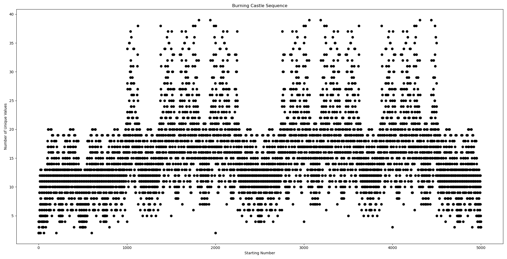
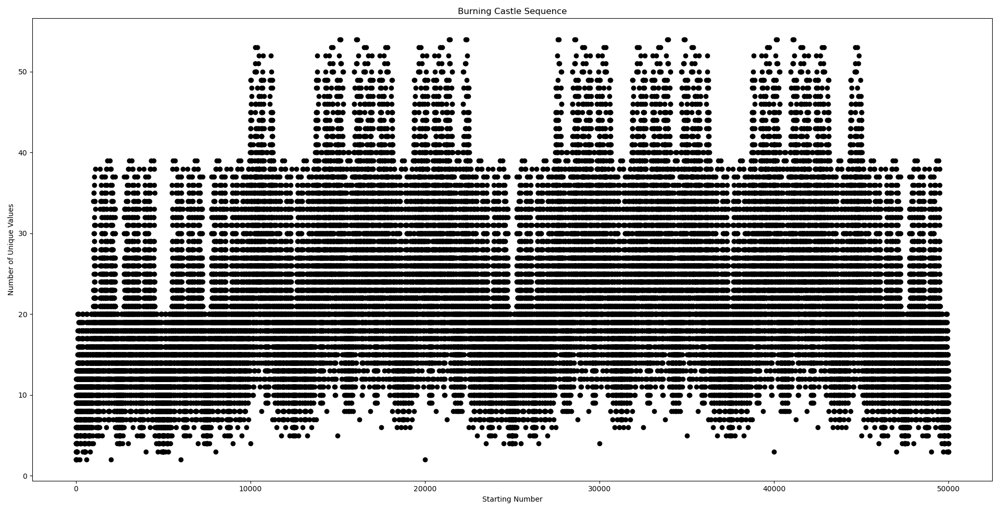
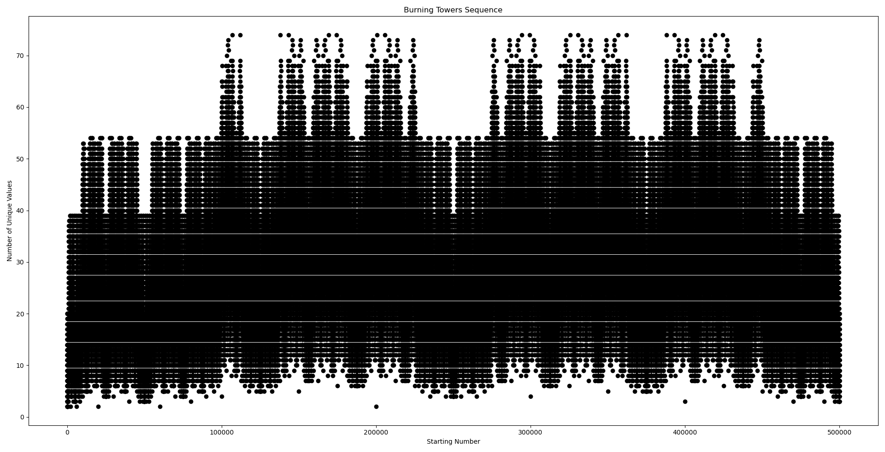
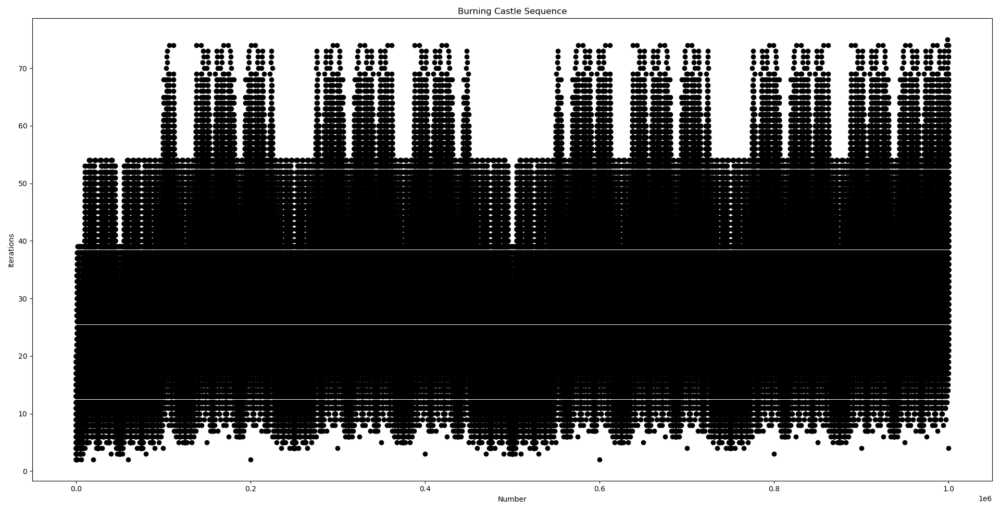

# 🔥 Burning Towers Sequence 🔥
This repository includes the code to obtain the Burning Towers Sequence.

## Initial Idea
Denote the [unit interval](https://en.wikipedia.org/wiki/Unit_interval) of real numbers `[0, 1]` as `I`. Consider the following recursive algorithm:
```python
def f(x):
  while (x < 0.1):
    x = x * 10 # eliminate prepending zeros
  see(x) # mark x as seen
  x_new := abs(2*x - 1) 
  if is_not_seen(x_new): # if this is a new x, recurse
    f(x_new)
```

Basically we double the number and subtract 1, then take it's absolute value. However, whenever the input is less than 0.1 (i.e it has a prepended 0 in its decimal expansion), we multiply it by 10 (i.e. remove the prepending zero and shift everything to the left). 

A few examples are:
- `0.2 -> 0.6 -> 0.2` (2 unique values)
- `0.5 -> 0 -> 1 -> 1` (3 unique values)
- `0.12 -> 0.76 -> 0.52 -> 0.4 -> 0.2 -> 0.6 -> 0.2` (6 uniqe values). Notice how we ignored `0.04` which is the result of `0.52` but it is less than `0.1`.

## Working with integers
Since the decimal operations are **imprecise**, we can't calculate them freely using our computer, the results will be wrong. We can instead use integers to simulate our algorithm. Suppose that the input is a number between 0 and 1, such as `0.abcd`, where `a`, `b`, `c` and `d` are non zero digits. Instead of doing `2x-1` on this number, we can treat `abcd` like an integer in base-10, and do `2x-1000`. Notice that we subtract `1000`, or in other words `10^(num_digits(abcd))`. How about the part where we check if the value is below `0.1`? Well, in this case we can check if the number is below `100`, i.e. `1000/10`. If so, we can just re-adjust our subtraction value, and then continue our calculations. With this, we can precisely simulate what would have happened to the decimal value on paper.

The new algorithm kind of looks like this:
```python
def f(x):
  sub = 10 ^ num_digits(x) # compute the subtractor 
  see(x)
  x_new = abs(2*x - sub)
  if is_not_seen(x_new):
    f(x_new)
```

The only problem here is when `x=0`, because it will loop like `0 -> 10 -> ...` which is not supposed to happen, instead we want `0 -> 1`. So when we come to `0` we can just go to `1` and terminate.

Looking at the same examples above:
- `2 -> 6 -> 2` (2 unique values)
- `5 -> 0 -> 1 -> 1` (3 unique values)
- `12 -> 76 -> 52 -> 4 -> 2 -> 6 -> 2` (6 unique values)


## Will it always terminate?
**Yes.** Take for example the integer algorithm explained just above, when we start with a value `x`, the results of the function are upperbounded by `100 * num_digits(x)`. So eventually, all numbers will be seen, it is trivial! We are more interested in what that number is.

# Burning Tower Number
Let us define the actual _Burning Tower Number_ for a given value: it is the number of unique seen values as we iterate through the function. 

For the same examples above:
- `0.2 ==> 2`
- `0.5 ==> 3`
- `0.12 ==> 6`

To make this an integer-to-integer sequence we can look at it as:
- `2 ==> 2` 
- `5 ==> 3`
- `12 ==> 6`

## Plots
The name _Burning Towers_ comes from the plots of this function from integers to integers. It seems as if there are a few towers that are on fire 🔥!

Up to 5,000:

 

Up to 50,000:

 

Up to 500,000:

 

Up to 1,000,000:

 