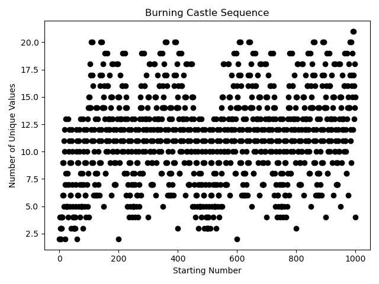
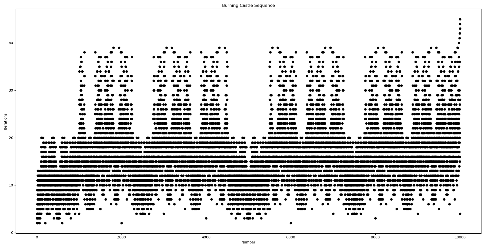
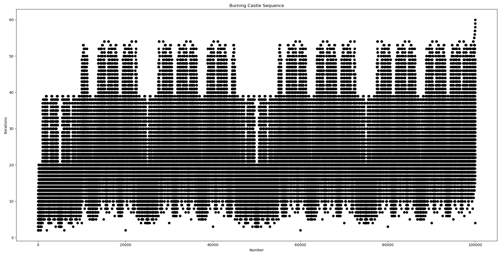
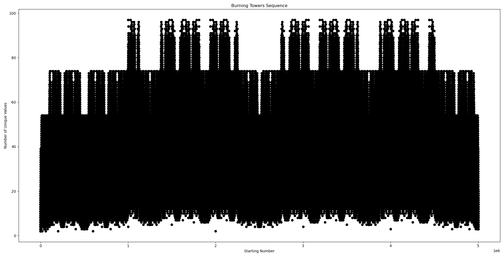

# 🔥🏰 Burning Castle 🏰🔥
This repository includes the code to obtain the Burning Towers Sequence.

## The Initial Algorithm
For a given number `x` such that `0 <= x <= 1` (a real value in unit interval), we double the number and subtract 1, then take it's absolute value. Whenever the input has prepended zero(s) in its decimal expansion we remove the prepending zero(s) and shift the decimals to the left, which is equivalent to multiplying the number with 10 when it is less than 0.1. We do this **before** the `|2x-1|` operation.

Suppose that we do this operation recursively, and we keep track of the numbers that go into the `|2x-1|` operation. We only stop when we come across to a number that we have seen before. **What we return in the end is the total number of numbers seen throughout this process**. That is the _Burning Castle_ number! 

This is described by the following algorithm:
```python
input: x
while x is not seen before
  # get rid of prepending zeros
  while x < 0.1
    x = x * 10 
  end while
  see(x)  
  x = |2*x - 1|
end while
output: number of seen values
```

A few examples are:
- `0.2 -> 0.6 -> 0.2` (2 unique values)
- `0.5 -> 0.0 -> 1.0 -> 1.0` (3 unique values)
- `0.12 -> 0.76 -> 0.52 -> 0.4 -> 0.2 -> 0.6 -> 0.2` (6 uniqe values). Notice how we did not *see* `0.04` which came right after `0.52` but it was less than `0.1`.

## Using integers instead
Since the decimal operations are **imprecise**, we can't do this without introducing errors using our computer. We can instead use **integers** to simulate our algorithm. Since the value is always between 0 and 1 (inclusive), what if we treat the decimal part of this number as an integer? We certainly can, and we can modify our algorithm accordingly.

Take for example a decimal number `0.abcd`, where `a`, `b`, `c` and `d` are non zero digits. Instead of doing `2x-1` on this number, we can treat `abcd` like an integer in base-10, and do `2x-1000`. Notice that we subtract `1000`, or in other words `10^(num_digits(abcd))`. With this, we can precisely simulate what would have happened to the decimal value on paper.

The new algorithm looks like this:
```python
input: x
while x is not seen before  
  see(x)
  x = |2*x - 10^(num_digits(x))|
end while
output: number of seen values
```
Note that there is no task of "eliminating prepending zeros" because a positive integer can't start with a zero.

Looking at the same examples above:
- `2 -> 6 -> 2` (2 unique values)
- `5 -> 0 -> 1 -> 1` (3 unique values)
- `12 -> 76 -> 52 -> 4 -> 2 -> 6 -> 2` (6 unique values)

There are some issues to be noted with this approach, listed here:

### What is 1.0?
When we use the integer `0`, we simulate the behaviour of `0.0`. When we use `1`, we simulate `0.1`. What about `1.0`? To handle this, we need to put a special condition for when we obtain a `0`. Every integer we have here corresponds to some number in the interval `[0, 1)`, and the operations are closed within this interval. We had initially defined our problem over `[0, 1]`, so how do account for the `1`? Well, no number other than `0` can ever get to `1` in the decimal setting. So `1.0` will never be seen before we get to `0.0`, of course assuming the input was not `1.0`. So for the integers, we can always assume the decimal `1.0` was not seen so far, and when `0` is seen, we just complete the process by saying `1` will also be seen next and then the process will stop, because `1.0` loops back to itself. 

In other words, when we get to integer `0`, with `n` seen values including `0`, we return `n+1` to account for the `1`.

There is more to this actually, we only get to `0` when the input `x` to `|2x-1|` is `0.5`. In the integer setting, this corresponds to the numbers `5, 50, 500, ...`. The sequence for them will always be like `0.5 -> 0.0 -> 1.0 -> 1.0`, i.e. 3 unique values only. 

Thanks to this information, we can just take care of these values (i.e. `0`, `5`, `50`, `500`, ...) before we begin the loop in our implementation.

### Appended Zeros?
Note that `0.1` and `0.10` are the same values, but as integers we get `1` and `10`, which are different. Thankfully this does not pose a problem: accounting for them or not does not change the result. This has been tested up to 50,000 values.

To show this, consider a value `x` for the operation `|2*x - 10^(num_digits(x))|`. Suppose `x` has `d` digits, so we do `|2x-10^d|`. Now consider `(10^k)*x` which is `x` but has `k` 0s appended to it. As a result, it has `d+k` digits. Now our operation is `|2(10^k)x - 10^(k+d)|` which is equal to `|(10^k)(2x-10^d)|`. If the input has appended zeros, the result will have them too. This does not change the result, because whatever sequence `x` has, `x` with appended zeros will have the same sequence, therefore will return the same amount of unique values seen.

### Will it always terminate?
**Yes.** The stopping condition of the algorithm is when we see a number we have seen before. The operation is closed within a finite set, so it is trivial that it should terminate eventually. We are thus interested in how long the iterations are, i.e. how many different numbers we have seen?
 
## Plots
The integer algorithm actually defines an integer sequence!
```markdown
        | 0.0 | 0.1 | 0.2 | 0.3 | 0.4 |  ...  |
| n     | 0   | 1   | 2   | 3   | 4   |  ...  |
-----------------------------------------------
| a(n)  | 2   | 4   | 2   | 4   | 3   |  ...  |
```
The name _Burning Castle_ comes from the plot of this integer sequence. It appears as if there is a giant castle forming before our eyes, which is burning at the bottom 🔥! _(squint your eyes for a better experience)_

Up to `1,000`:

 

Up to `10,000`:

 

Up to `100,000`:

 

Up to `1,000,000`:

 

Note that as we increase the number of digits, we increase our precision. For example, numbers from 0 to 1000 cover the decimal values up to 3 decimal points, because the values (except 1000) are at most 3 digits. So as we icnrease the number, we further include more precise decimal numbers in our plot.

The plots are particularly cool when the numbers are up to `500..0` too. 

Up to `5,000`:

 

Up to `50,000`:

 

Up to `500,000`:

 

Up to `5,000,000`:

 

