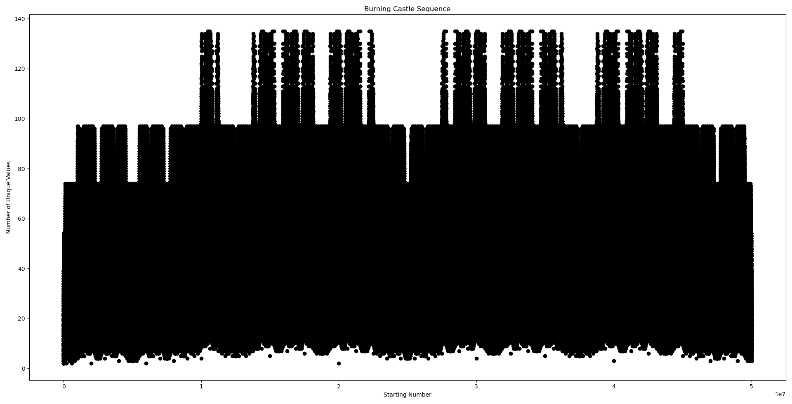

# 🔥🏰 Burning Castle 🏰🔥
This repository includes the code to obtain the Burning Towers Sequence.

## Initial Idea
Consider the following algorithm:
```python
while is_not_seen(x):
  # eliminate prepending zeros
  while (x < 0.1):
    x = x * 10 
  see(x) # mark x as seen
  x = abs(2*x - 1) 
return number_of_seens()
```

Basically we double the number and subtract 1, then take it's absolute value. However, whenever the input is less than 0.1 (i.e it has a prepended 0 in its decimal expansion), we multiply it by 10 (i.e. remove the prepending zero and shift everything to the left). 

A few examples are:
- `0.2 -> 0.6 -> 0.2` (2 unique values)
- `0.5 -> 0 -> 1 -> 1` (3 unique values)
- `0.12 -> 0.76 -> 0.52 -> 0.4 -> 0.2 -> 0.6 -> 0.2` (6 uniqe values). Notice how we did not *see* `0.04` which came right after `0.52` but it was less than `0.1`.

## Using integers instead
Since the decimal operations are **imprecise**, we can't calculate them without errors using our computer. We can instead use integers to simulate our algorithm. Suppose that the input is a number between 0 and 1, such as `0.abcd`, where `a`, `b`, `c` and `d` are non zero digits. Instead of doing `2x-1` on this number, we can treat `abcd` like an integer in base-10, and do `2x-1000`. Notice that we subtract `1000`, or in other words `10^(num_digits(abcd))`. How about the part where we check if the value is below `0.1`? Well, in this case we can check if the number is below `100`, i.e. `1000/10`. If so, we can just re-adjust our subtraction value, and then continue our calculations. With this, we can precisely simulate what would have happened to the decimal value on paper.

The new algorithm looks like this:
```python
seens = {} 
while x not in seens:  
  seens[x] = True
  x = abs((x << 1) - int('1' + '0'*len(str(x)))) if x != 0 else 1     
return len(seens)
```
Note that there is no task of "eliminating prepending zeros" because the integer can't start with a zero.

Looking at the same examples above:
- `2 -> 6 -> 2` (2 unique values)
- `5 -> 0 -> 1 -> 1` (3 unique values)
- `12 -> 76 -> 52 -> 4 -> 2 -> 6 -> 2` (6 unique values)

We should also note that the occurences of appended 0s are not a problem, they do not change the result. This has been tested up to 50,000 values too.

## Will it always terminate?
**Yes.** Take for example the integer algorithm explained just above, when we start with a value `x`, the results of the function are upperbounded by `100 * num_digits(x)`. So eventually, all numbers will be seen, it is trivial! We are more interested in _what that number is_.

# Burning Castle Number
Let us define the actual _Burning Castle Number_ for a given value: it is the number of unique seen values as we iterate through the function. 

For the same examples above:
- `0.2 ==> 2`
- `0.5 ==> 3`
- `0.12 ==> 6`

To make this an integer-to-integer sequence we can look at it as:
- `2 ==> 2` 
- `5 ==> 3`
- `12 ==> 6`

## Plots
The name _Burning Castle_ comes from the plots of this function from integers to integers. It seems as if there is a huge castle that is on fire 🔥!

Up to 5,000:

 

Up to 50,000:

 

Up to 500,000:

 

Up to 5,000,000:

 

Up to 50,000,000:

 

The plots are particularly cool when the numbers are upto 500..0. It appears as if there is a giant castle forming before our eyes, which is burning at the bottom! _(squint your eyes for a better experience)_

## TODO:
- [ ] Create b files
- [ ] Refurnish definitions