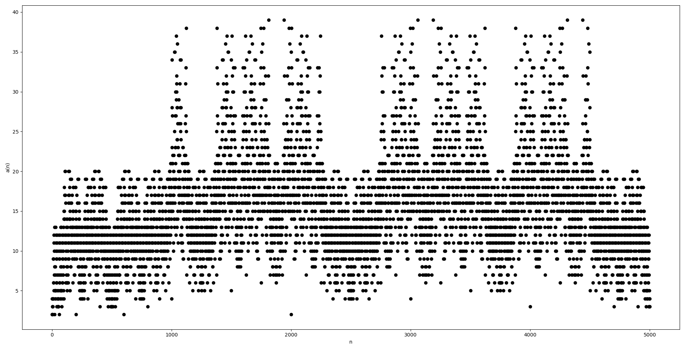

  

# Burning Castle
This repository includes codes and plots for the following OEIS submissions: 

- **Formerly A342631, removed and recycled for being too artificial** `a(n)` is the number of distinct values in the recursive iterations of `f(x) = f(g(|2x-1|))` starting from a real number `x` where `x = 0` or `0.1 <= x < 1`, `n` is the fractional part of the decimal `x`, and `g(x)` removes prepending zeros from the fractional part of `x`. I thought this looked like a burning castle image, thus has been given the name of this repository. The image seen above is the plot of this sequence up to 5 million, _with some additional visual flare :)_

 

- **Formerly A343274, removed and recycled for being too artificial**: `a(n)` is the number of distinct values in the recursive iterations of `f(x) = f(|2x-1|)` starting from a real number  `x` where `x = 0` or `0.1 <= x < 1`, `n` is the fractional part of the decimal `x`. The only difference between the sequence above and this one is the `g` function inside `f`; however, that significantly changes the resulting plot.

 

- [A343275](https://oeis.org/A343275) `a(n) = |2n-10^num_digits(n)|`, `n` is a positive integer. This is basically what is done within the two sequences above. The plots are V shaped for each interval `0`-`10`-`100`-`1000` and so on.

 
